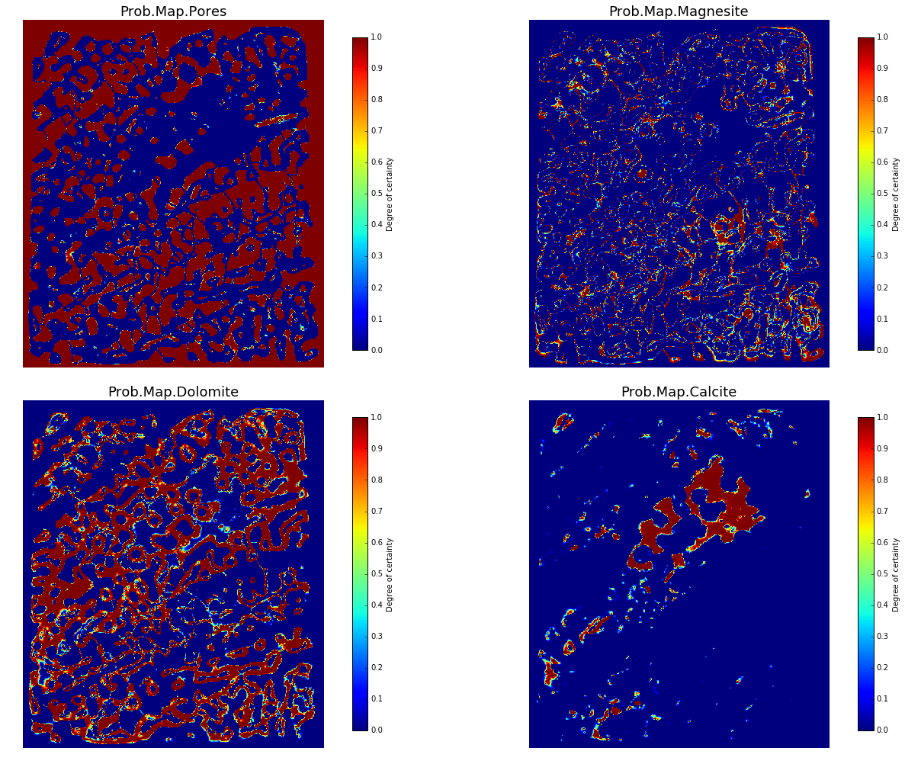
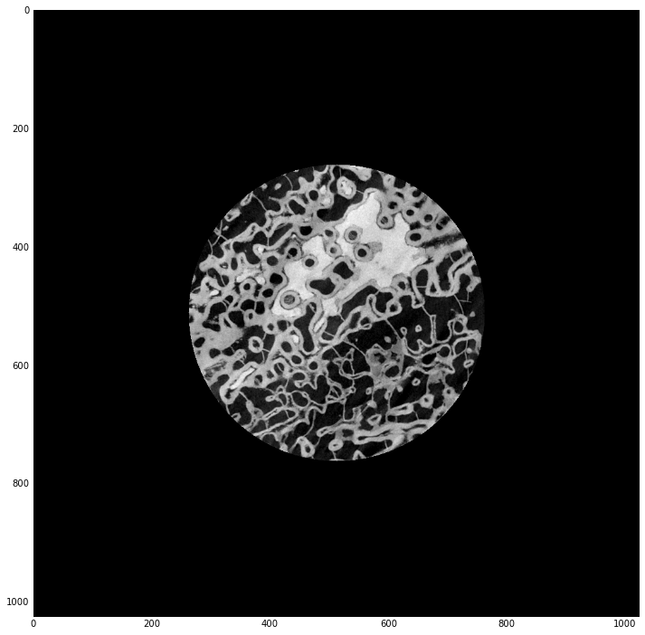

# µCT Image Processing using Python and Scikit-Image
Yili (Eli) Yang | yili.yang@ed.ac.uk

## Introduction
X-ray μCT imaging technology has been widely used in Geosciences, it uses x-rays to generate cross-sections of an object that can be used to recreate a 3D dataset without destroying the original object. By stacking the image cross-sections in sequence, we can easily reconstruct the 3D virtual object. Below is an example of how to process and analyse 3D X-ray μCT data of a dolomitised sample from Jonas et al. (2015）.

Below is a tutorial for developing a image processing script that has functions such as loading images, manipulating images, de-noising and segmentation using scikit-image; 

The practical will inform you how to produce a good quality segmentation using marker-based algorithms. Further instructions are given below.

### Setup environment and modules
First of all import relevant modules. Python modules or libraries are packages of existed codes and functions that can be called to use, they have to be imported before calling the functions. 


```python
#make jupyter notebook matplotlib plot inline
%matplotlib inline 

#import global modules and libraries

import glob #a module that supports the * expression 
from PIL import Image #crucial library for image processing
import numpy as np #numpy is a major library for numerical operations 
from scipy import ndimage #scipy is for scientific python, ndimage is another image processing library
import matplotlib.pyplot as plt #matplotlib is a library for plotting diagrams and graphs
from skimage.io import imsave #scikit image input and output functions
import time # a time function that can count execution time
import sys #use sys.stdout.write to print progress
```

###Read CT data into python
In order to import the CT images in 3D, we need to stack the images successively. To do this, create a three-dimensional array as a 'container' of the values of the image stack, and import the pixel values of the images into the 3D numpy array. Each element in this array represents the value of the corresponding voxel in 3D. 

 Technical characteristics of 3-D digital image data (Modified from JA Richards, 1999) illustrate how CT images are stacked to create a 3-D object


** Read CT data from file folder. Type in the path of the data folder to replace the red text.**

First, in the 'main' loop, read tif files into a list called 'infiles'. 


```python
if __name__ == "__main__":
    infiles = sorted(glob.glob('C:\Users\s1367222\Google Drive\SATUTRACK2 PHD\RIO2017\Short courses Rio 2017\Porites/*.tif')) 
    # *.tif import all files that ended with .tif
```

The variable 'infiles' is a list that contains all filenames in tiff format and sorted by file No.


```python
infiles
```


    ['C:\\Users\\s1367222\\Google Drive\\SATUTRACK2 PHD\\RIO2017\\Short courses Rio 2017\\Porites\\IMAGE0700.tif',
     'C:\\Users\\s1367222\\Google Drive\\SATUTRACK2 PHD\\RIO2017\\Short courses Rio 2017\\Porites\\IMAGE0701.tif',
     'C:\\Users\\s1367222\\Google Drive\\SATUTRACK2 PHD\\RIO2017\\Short courses Rio 2017\\Porites\\IMAGE0702.tif',
     'C:\\Users\\s1367222\\Google Drive\\SATUTRACK2 PHD\\RIO2017\\Short courses Rio 2017\\Porites\\IMAGE0703.tif',
     'C:\\Users\\s1367222\\Google Drive\\SATUTRACK2 PHD\\RIO2017\\Short courses Rio 2017\\Porites\\IMAGE0704.tif',
     'C:\\Users\\s1367222\\Google Drive\\SATUTRACK2 PHD\\RIO2017\\Short courses Rio 2017\\Porites\\IMAGE0705.tif',
     'C:\\Users\\s1367222\\Google Drive\\SATUTRACK2 PHD\\RIO2017\\Short courses Rio 2017\\Porites\\IMAGE0706.tif',
     'C:\\Users\\s1367222\\Google Drive\\SATUTRACK2 PHD\\RIO2017\\Short courses Rio 2017\\Porites\\IMAGE0707.tif',
     'C:\\Users\\s1367222\\Google Drive\\SATUTRACK2 PHD\\RIO2017\\Short courses Rio 2017\\Porites\\IMAGE0708.tif',
     'C:\\Users\\s1367222\\Google Drive\\SATUTRACK2 PHD\\RIO2017\\Short courses Rio 2017\\Porites\\IMAGE0709.tif',
     'C:\\Users\\s1367222\\Google Drive\\SATUTRACK2 PHD\\RIO2017\\Short courses Rio 2017\\Porites\\IMAGE0710.tif']


Below is a function called 'stack' that reads CT images and stacks them into a 3-D array. Try to read and understand how it works.


```python
#define a function called 'stack' to import the CT files and stack them in a 3D array.
def stack(batch_name): #require a batch_name to be input
    im = Image.open(batch_name[0]) #open the first image of the batch to acquire the image size
    
    #create an empty array that has the same shape as the 3D dataset and padded with zeros.
    imgs = np.zeros((len(batch_name),im.size[1],im.size[0]))
    
    i = 0 #start a counter that start from 0 to count iteration loops.
    
    #loop the files, each iteration adds one slice layer into the array.
    for imfile in batch_name: 
        inputslice = Image.open(imfile)
        inputslice = np.array(inputslice)
        imgs[i,:,:] = np.array(inputslice)
        i+=1 #when a loop finished increase 1 to i
    return imgs #return stacked 3d array as output of function 'stack'
```

This function requires a list as input, and will 'stack' each image from the list sequentially, to produce a 3-D numpy array that has the size of (lenth x width x slices).

**Call the function 'stack' to process the list of CT images that just imported into 'infiles'. Then use 'dolo.shape' to check the dimension of the 3D array.**


```python
dolo=stack(infiles)
dolo.shape
```


    (11L, 1024L, 1024L)


 The shape output indicates that the 3D array 'dolo' is (1024 width x 1024 length x 11 slices), and the data type is 'long integers'.

###View imported image

Define a function called 'view' to view slice i in dataset 'image'.


```python
def view(image,i): #require inputs of an image array 'image' and a slice number i.
    
    plt.figure(figsize=(12,12),dpi=100)#this changes the figsize, has to be before imshow
    
    if image.ndim==3: #if the input is a 3d array
        plt.imshow(image[i-1],cmap='gray') #show the first image of 'dolo' using grayscale colourmap

    else: #if the input is a 2d array
        plt.imshow(image,cmap='gray') #show the first image of 'dolo' using grayscale colourmap
    

    return
```

** Call 'viweim' to view any slice of the image stack 'dolo'. **


```python
view(dolo,1)
```


**Type in a set of suitable parameters [zmin:zmax,ymin:ymax,xmin:xmax] to crop the image.**


```python
resized_dolo=dolo[:,200:-170,220:-240]#cropping [zmin:zmax,ymin:ymax,xmin:xmax], negative means counting backwards
view(resized_dolo,1)
resized_dolo.shape
```


    (11L, 654L, 564L)


###Pre-processing

Pre-processing includes steps such as adjusting contrast, rescaling values, finding objects, denoising etc., which are the preparation steps for later processing. How much pre-processing needs to be done depends on the image quality and image processing objectives. For example, thresholding-based segmentation requires a good contrast between different objects.

You may find that there are stripes or ring artifacts or noises (referred to as 'salt and pepper') on the image, try to use the code given below to improve image quality.


###rescale
Notice that scikit-image algorithms require floating-point images to have values between 0 and 1, howerver the original image is 8-bit i.e. the values are ranged from 0-255. 

'rescale' is a function for rescaling the data to 0-1 floating-point. The expression normalises the values in 'batch_name' so that the values fall between 0 and 1.


```python
from scipy import stats 
def rescale(batch_name):
    vmin, vmax = stats.scoreatpercentile(batch_name, (0.1, 99.9))
    batch_name = np.clip(batch_name, vmin, vmax)#Clip (limit) the values in imgs
    batch_name = (batch_name - vmin) / (vmax - vmin)   
    return batch_name
```

**Call the function rescale to normalise the values in resize_dolo and name it rescaled_dolo**


```python
rescaled_dolo=rescale(resized_dolo)
```

Below is a function that calls the non-local-means denoising algorithm from library skimage.restoration

Non-local-means denoising is quite CPU-heavy so a timer 'start_time' is added to print the execution time. The denoising is done slice-by-slice, rather than in 3D for saving execution time.

http://scikit-image.org/docs/dev/api/skimage.restoration.html#nl-means-denoising


```python
from skimage.restoration import denoise_nl_means

def nlm(batch_name):
    start_time=time.time()
    im = Image.fromarray(batch_name[0])
    denoised=np.zeros((len(batch_name),im.size[1],im.size[0]))
    i=0
    for slice in batch_name:
        inputslice=denoise_nl_means(slice, patch_size=3, patch_distance=9, h=0.08, fast_mode=True, multichannel=False)
 
        inputslice = np.array(inputslice)
        denoised[i,:,:] = np.array(inputslice)
        i+=1 #when a loop finished increase 1 for i

    print 'NLM denoise finished, time:', (time.time() - start_time) , 's'
    return denoised
```

###denoise_nl_means

/>>(skimage.restoration.denoise_nl_means(image, patch_size=7, patch_distance=11, h=0.1, multichannel=None, fast_mode=True)[source]

Perform non-local means denoising on 2-D or 3-D grayscale images, and 2-D RGB images.

**Parameters:**
>**image : 2D or 3D ndarray**|
Input image to be denoised, which can be 2D or 3D, and grayscale or RGB (for 2D images only, see multichannel parameter).

>**patch_size : int, optional**|
Size of patches used for denoising.

>**patch_distance : int, optional**|
Maximal distance in pixels where to search patches used for denoising.

>**h : float, optional**|
Cut-off distance (in gray levels). The higher h, the more permissive one is in accepting patches. A higher h results in a smoother image, at the expense of blurring features. For a Gaussian noise of standard deviation sigma, a rule of thumb is to choose the value of h to be sigma of slightly less.

>**multichannel : bool, optional**|
Whether the last axis of the image is to be interpreted as multiple channels or another spatial dimension. Set to False for 3-D images.

>**fast_mode : bool, optional**|
If True (default value), a fast version of the non-local means algorithm is used. If False, the original version of non-local means is used. See the Notes section for more details about the algorithms.

**Notes**

The non-local means algorithm is well suited for denoising images with specific textures. The principle of the algorithm is to average the value of a given pixel with values of other pixels in a limited neighbourhood, provided that the patches centered on the other pixels are similar enough to the patch centered on the pixel of interest.

In the original version of the algorithm [R416], corresponding to fast=False, the computational complexity is

image.size * patch_size ** image.ndim * patch_distance ** image.ndim

Hence, changing the size of patches or their maximal distance has a strong effect on computing times, especially for 3-D images.

However, the default behavior corresponds to fast_mode=True, for which another version of non-local means [R417] is used, corresponding to a complexity of

image.size * patch_distance ** image.ndim

The computing time depends only weakly on the patch size, thanks to the computation of the integral of patches distances for a given shift, that reduces the number of operations [R416]. Therefore, this algorithm executes faster than the classic algorith (fast_mode=False), at the expense of using twice as much memory. This implementation has been proven to be more efficient compared to other alternatives, see e.g. [R418].

Compared to the classic algorithm, all pixels of a patch contribute to the distance to another patch with the same weight, no matter their distance to the center of the patch. This coarser computation of the distance can result in a slightly poorer denoising performance. Moreover, for small images (images with a linear size that is only a few times the patch size), the classic algorithm can be faster due to boundary effects.

The image is padded using the reflect mode of skimage.util.pad before denoising.

**To use non-local-means denoising on the dataset 'resize_dolo', and name the output dataset as 'nlm_dolo’：**


```python
nlm_dolo=nlm(rescaled_dolo[:])
```

    NLM denoise finished, time: 50.0920000076 s
    

Now compare the before & after of non-local-means denoising: 

here I define a function called 'compare', to compare slice i of image a and the same slice of image b:


```python
def compare(a,b,i):
    
    fig, axes = plt.subplots(ncols=2, figsize=(15, 15))
    ax0, ax1= axes
    
    #if the input is a 3d image, print slice a; else print a 2d image
    if a.ndim==2:
        ax0.imshow(a, cmap='gray')
        ax0.set_title("Image A")
    else:
        ax0.imshow(a[i-1], cmap='gray')
        ax0.set_title("Image A")
    
    if b.ndim==2:
        ax1.imshow(b, cmap='gray')
        ax1.set_title("Image B")
    else:
        ax1.imshow(b[i-1], cmap='gray')
        ax1.set_title("Image B")
    fig.suptitle('Comparison of Images', y=0.77, fontsize=20)

    plt.subplots_adjust(left=None, bottom=None, right=None, top=None
                        , wspace=0.1, hspace=None)
```

**Call the function to compare the first slice of resized_dolo and nlm_dolo.**


```python
compare(rescaled_dolo,nlm_dolo,1)
```


For NLM parameters, refer to the website to get the best result:

http://scikit-image.org/docs/dev/api/skimage.restoration.html#skimage.restoration.nl_means_denoising

For alternative denoising algorithms, skimage.restoration provides a range of different algorithms to choose from:

http://scikit-image.org/docs/dev/api/skimage.restoration.html#

**Try to use the bilateral filter 'skimage.restoration.denoise_bilateral' to denoise the image and use the compare function to compare with the NLM denoised image.**


```python
import skimage.restoration

def bilateral(batch_name):
    out=skimage.restoration.denoise_bilateral(batch_name)
    return out
```


```python
bilateral_dolo=bilateral(rescaled_dolo)
```

    C:\Users\s1367222\AppData\Local\Continuum\Anaconda\lib\site-packages\skimage\restoration\_denoise.py:92: UserWarning: The last axis of the input image is interpreted as channels. Input image with shape (11L, 654L, 564L) has 564 channels in last axis. ``denoise_bilateral`` is implemented for 2D grayscale and color images only.
      "only.".format(image.shape, image.shape[2]))
    


```python
compare(bilateral_dolo,nlm_dolo,1)
```


###Segmentation


Segmentation is a step to classify the objects on images into meaningful catagories. In this case, the segmentation phases are :

    black :pores
    dark grey :magnesite
    light grey :dolomite
    white :calcite

**Marker-based segmentation**

Marker-based segmentation uses pre-assigned markers as 'seeds'. The algorithm will diffuse the 'seeds' until they reach certain condition, for example, critical gradient or max distance.

RandomWalker (Grady, 2006) and Watershed both can be applied with markers. The easiest way to assign markers in this case is to use gray values, since the phases in CT images are distinguished by different gray values that caused by X-ray attenuation.

Random Walker: http://scikit-image.org/docs/stable/api/skimage.segmentation.html#skimage.segmentation.random_walker

Watershed: http://scikit-image.org/docs/stable/api/skimage.morphology.html#skimage.morphology.watershed

There is also marker-independent segmentation algorithm such as K-means clustering.

SLIC: http://scikit-image.org/docs/stable/api/skimage.segmentation.html#slic

In order to visualise the grey value distribution of the image, first we need to plot a histogram of the data. Below is a function that can produce histogram for a given dataset.

 


```python
from skimage import exposure
def plothist(batch_name):
    histo = exposure.histogram(batch_name)
    plt.plot(histo[1], histo[0], label='data')
    plt.xlim(0, 1)
    plt.yscale('log')
    plt.title('Stacked Histogram of voxel values')
    return
```

**Practice 9: Call the function 'plothist' to plot the histogram of the processed dataset**


```python
plothist(rescaled_dolo)
plothist(nlm_dolo)
plothist(bilateral_dolo)
```


This histogram gives us a general view of value distribution of the CT dataset. The peak at 0.0 is recognised as background (pore), the valley around 0.4 is dark grey and has relatively small portion to the total volume, which should be the thin connections of the coral sample. Another peak at around 0.7 consists most of the shallow grey on the image; The rest of the voxels are the brightest from 0.9 to 1. As we have a rough idea about how to threshold the image by intensity number, then we can go on defining the range for the markers.

####Define the range of markers
This is the crucial step that mostly affect the segmentation outcome, you may need to trail and error for some times to get the best parameters for a dataset

Below is a function called 'mark', for assigning appropriate values to define the range of each phase.


```python
def mark(batch_name, bgd, phaseA_min, phaseA_max, phaseB_min, phaseB_max, phaseC_min):
    markers = np.zeros(batch_name.shape, dtype=np.int8)
    markers[batch_name < bgd] = 1
    markers[np.logical_and(batch_name > phaseA_min, batch_name < phaseA_max)] = 2
    markers[np.logical_and(batch_name > phaseB_min, batch_name < phaseB_max)] = 3
    markers[batch_name > phaseC_min] = 4
    compare(batch_name,markers,1)
    return markers
```


**Assign ranges to each phase according to the histogram you've just plotted, then visualise the markers and compare with the original image, find the best threshold.**


```python
marked_dolo=mark(rescaled_dolo,bgd=0.2,phaseA_min=0.3,phaseA_max=0.5,phaseB_min=0.6,phaseB_max=0.75,phaseC_min=0.84)
```


###Marker based segmentation

Noticed that there are still some areas shown as unselected, simply because their values are 'fuzzy', so global thresholding can lead to misclassification. The markers are used as 'seeds' for 'marker-based segmentation' such as Random-Walker and Watershed. These 'softer' algorithms use probability by methods such as path-finding and region growing, to extrapolate more localised segmentation. Essentially in this case, we use marker based segmentation to fill the gaps of 'fuzzy' areas.

Below are functions called rwseg(random-walker segmentation) and wsseg(watershed segmentation).


```python
from skimage import segmentation
from skimage.morphology import watershed

def rwseg(batch_name,markers):
    start_time=time.time()
    rw = segmentation.random_walker(batch_name, markers, beta=100, mode='cg_mg', copy=False, return_full_prob=False)#beta=diffusion difficulty   
    print 'RW segmentation finished, time:', (time.time() - start_time) , 's'
    return rw

def wsseg(batch_name,markers):
    start_time=time.time()
    ws = watershed(batch_name, markers, offset=None, mask=None) 
    print 'WS segmentation finished, time:', (time.time() - start_time) , 's'
    return ws

```

**apply either of the function to the denoised dataset, and provide it with a marker that you just created. And compare the output with 'compare'.**


```python
ws_dolo=wsseg(nlm_dolo,marked_dolo)
compare(rescaled_dolo,ws_dolo,1)
```

    WS segmentation finished, time: 5.60000014305 s
    


This plot shows the segmentation result of watershed algorithm in comparison with the input non-local-means denoised image


```python
rw_dolo=rwseg(nlm_dolo,marked_dolo)
compare(rescaled_dolo,rw_dolo,1)
```

    RW segmentation finished, time: 6.53900003433 s
    

    C:\Users\s1367222\AppData\Local\Continuum\Anaconda\lib\site-packages\skimage\segmentation\random_walker_segmentation.py:445: UserWarning: pyamg (http://pyamg.org/)) is needed to use
                    this mode, but is not installed. The 'cg' mode will be used
                    instead.
      instead.""")
    


This plot compares the input non-local-means denoised image and the segmentation result by random walker

###Visualise a probability map

Random walker has a build-in probability map option that can return full probability map of the segmented phases. The map can visualise the certainty of the segmentation.


```python
pm = segmentation.random_walker(nlm_dolo, marked_dolo, beta=500, mode='cg_mg', copy=False, return_full_prob=True)
```

The variable 'pm' is an array that contains the probability map, here I define a function called probmap to plot the probability map separately.


```python
def probmap(pm,i):
    fig, axes = plt.subplots(nrows=2,ncols=2)
    (ax0, ax1), (ax2, ax3) = axes
    
    ax0.imshow(pm[0,i-1])
    ax0.set_title('Prob.Map.Pores',fontsize=18)
    ax0.axis('off')
    ax1.imshow(pm[1,i-1])
    ax1.set_title('Prob.Map.Magnesite',fontsize=18)
    ax1.axis('off')
    ax2.imshow(pm[2,i-1])
    ax2.set_title('Prob.Map.Dolomite',fontsize=18)
    ax2.axis('off')    
    ax3.imshow(pm[3,i-1])
    ax3.set_title('Prob.Map.Calcite',fontsize=18)
    ax3.axis('off')    
    
    fig.set_size_inches(20, 14)

    cax3 = ax3.imshow(pm[3,i-1], interpolation='nearest', vmin=0, vmax=1)
    cax2 = ax2.imshow(pm[2,i-1], interpolation='nearest', vmin=0, vmax=1)
    cax1 = ax1.imshow(pm[1,i-1], interpolation='nearest', vmin=0, vmax=1)
    cax0 = ax0.imshow(pm[0,i-1], interpolation='nearest', vmin=0, vmax=1)
    
    cb0 = fig.colorbar(cax0,ax=ax0,shrink=0.9)  
    cb1 = fig.colorbar(cax1,ax=ax1,shrink=0.9)
    cb2 = fig.colorbar(cax3,ax=ax2,shrink=0.9)  
    cb3 = fig.colorbar(cax2,ax=ax3,shrink=0.9)  
    
    cb0.ax.set_ylabel('Degree of certainty', rotation=90)
    cb1.ax.set_ylabel('Degree of certainty', rotation=90)
    cb2.ax.set_ylabel('Degree of certainty', rotation=90)
    cb3.ax.set_ylabel('Degree of certainty', rotation=90)
    
    fig.subplots_adjust(left=None, bottom=None, right=None, top=None, wspace=None, hspace=None)
    fig.tight_layout()
    #plt.savefig("Prob_Map%04d.png"%i,bbox_inches='tight',dpi=250)
    #plt.close()
```

**the function 'probmap' with input 'pm', and print the probability map of the first slice.**


```python
probmap(pm,1)
```





The probability map is essentially a contour map that shows the probability percentage distribution of each pixel belong to each phase. To read this map, 1 means 100% sure that a pixel belongs to this phase, 0 means 100 sure that a pixel does not belong to this phase. And any value inbetween has some degree of uncertainty.

Furthermore, we can threshold the probability map to a cut-off point, say 95% certainty, to produce more robust segmentation.

###Save segmented image to a directory

Below is a function that can save files to any given directory.


```python
import scipy.misc
import os.path

def save(batch_name,directory):
    if not os.path.exists(directory):
        os.makedirs(directory)
    for x in xrange(0,len(batch_name[0::])): 
        scipy.misc.imsave(os.path.join(directory,'seg_%04d.tif'%x),batch_name[x])
        
```

**Practice 14: Save the segmented images to a folder called segmented_dolo**


```python
save(nlm_dolo,'C:\Users\s1367222\Google Drive\dolo')
```

###Automation
workflow2d is a function that requires a input batch name and a folder path and it will run the complete segmentation workflow and save it to the path provided.

**following function is a function that automatically processing and segmenting the images and saving to the given folder.**


```python
def workflow2d(batch_name,folder):
    i=0
    folder=str(folder)
    for imfile in batch_name:
        im = Image.open(imfile)
        im = np.array(im)
        markers = mark(im)
        segmentation = rwseg(im,markers)
        directory=folder 
        if not os.path.exists(directory):
            os.makedirs(directory)
        scipy.misc.imsave(os.path.join(directory,'seg'+str(i)+'.tif'),segmentation)
        sys.stdout.write('\r %d of %d images completed.'% ( (i+1),len(batch_name) )) #print text progress bar
        sys.stdout.flush()
        i+=1
    return 
```

###Misc

###Core Masking
If the volume of interest is a cylinder, you may need a circle mask to cut the background:


```python
def circle(batch_name,r):
    leng= Image.fromarray(batch_name[0]).size[1]
    widt= Image.fromarray(batch_name[0]).size[0]       
    a, b = leng/2,widt/2
    y,x = np.ogrid[-a:leng-a, -b:widt-b]
    mask = x*x + y*y <= r*r
    array = np.zeros((leng, widt))
    array[mask] = 1
    masked = mask * np.asarray(batch_name)
    masked = masked #cropping (y,x)
    return masked
```


```python
masked=circle(dolo,250)
```


```python
view(masked,1)
```





```python

```
